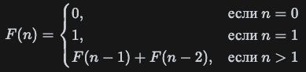

# Числа Фибоначчи

Числа Фибоначчи — это последовательность чисел, в которой каждое число является суммой двух предыдущих.
Последовательность начинается с 0 и 1 (или иногда с 1 и 1).

## Формула

## Пример последовательности

0,1,1,2,3,5,8,13,21,34,55,…

## Способы вычисления

- Итеративный (цикл);
- Рекурсивный (рекурсия).

## Преимущества/Недостатки

| Реализация  | Преимущества                   | Недостатки                          |
|:-----------:|:-------------------------------|:------------------------------------|
| Итеративная | Эффективно по времени и памяти | Не подходит для очень больших чисел |
| Рекурсивная | Простая реализация             | Может вызвать переполнение стека    |

## Задачки

1. [Реализовать итеративную реализацию фибоначчи](fibonacciIterative.js)
2. [Реализовать рекурсивную реализацию фибоначчи](fibonacciRecursive.js)