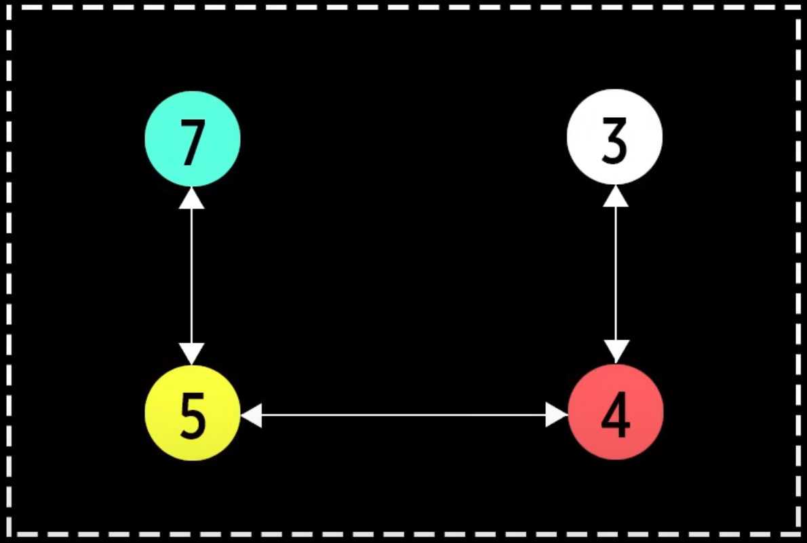
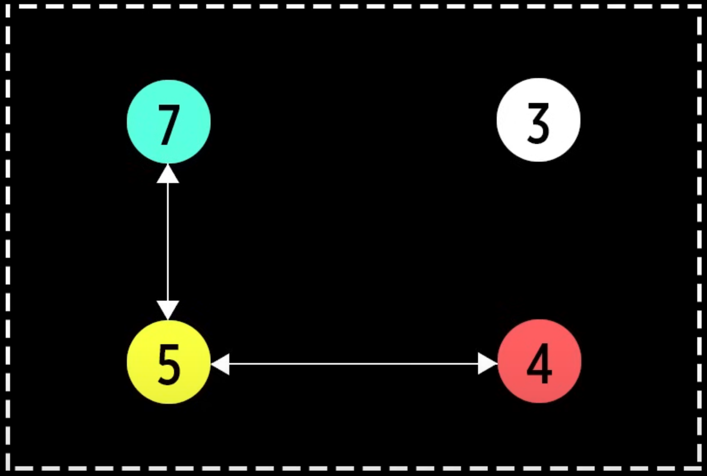
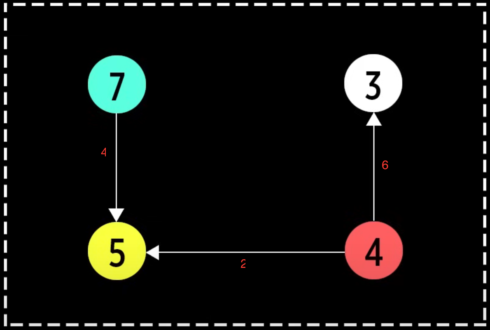

# Граф (Graph) 

Структура данных, используемая для представления связей между объектами.

## Основные характеристики

- Состоит из вершин (nodes/vertices);
- Ребер (edges), которые соединяют вершины.

## Основные термины

- Вершина (Node/Vertex) - это элемент графа;
- Ребро (Edge) - это связь между двумя вершинами. Может быть:
  - Ориентированным;
  - Неориентированным.
- Вес ребра (Weight) - это числовая характеристика ребра.

## Типы графов

- Неориентированный, если каждое ребро имеет два направления;
   
- Ориентированный, если все ребра имеют конкретное направление;
   
- Связный, если между любой парой существует минимум один путь;
   
- Несвязный, если хотя бы между одной парой узлов путь отсутствует;
   
- Взвешенный, если у каждого ребра есть некое значение (вес ребра).
   

## Использование

- Моделирование связей: Графы идеальны для представления связей между объектами;
- Поиск оптимальных путей.

## Преимущества

- Графы идеально подходят для представления любых отношений между объектами;
- Вершины могут хранить любые данные (текст, числа, объекты), а ребра — веса, метки или дополнительные свойства;
- Реализация поиска оптимальных путей;
- Графы могут содержать циклы, что невозможно в деревьях или связных списках;
- Можно добавить несколько ребер между вершинами.

## Недостатки

- Сложность реализации: Для больших графов требуется эффективный алгоритм;
- Память: Матрица смежности требует O(n²) памяти для n вершин.

## Сложность операций

| Операция           | Сложность |
|:-------------------|:----------|
| Добавление вершины | O(1)      |
| Добавление ребра   | O(1)      |
| Удаление вершины   | O(V + E)  |
| Удаление ребра     | O(E)      |

V — количество вершин (vertices) в графе.
E — количество ребер (edges) в графе.

## Задачки

1. [Реализовать граф](graph.js)
2. [Реализовать вершину графа](graphVertex.js)
3. [Реализовать ребро графа](graphEdge.js)

## Ресурсы

- [Alek OS](https://www.youtube.com/watch?v=VehB3eglQMQ&t=551s)
- [Визуализация](https://visualgo.net/en/graphds)