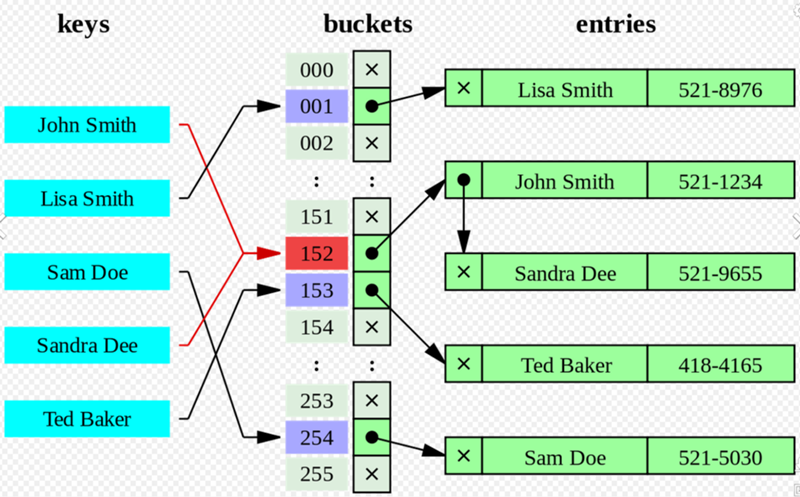

# Метод цепочек

Метод цепочек подразумевает хранение значений, соответствующих одному и тому же индексу в виде связного списка или другого контейнера.

[Реализация хеш-таблицы](hashTable.js)

## Преимущество

- Простота реализации;
- Возможность хранения неограниченного количества элементов.

## Недостаток

- Требуется дополнительная память для хранения цепочек, что может привести к меньшей производительности при большом количестве коллизий.