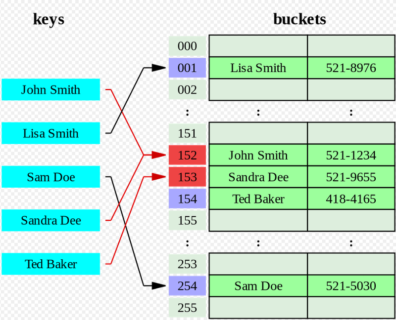

# Подход линейный

Подход решает коллизии путём поиска следующей свободной ячейки в массиве.
Этот подход использует уравнение:

`newIndex = (index + 1) mod size`

где
- index - значение, полученное из хеш-функции;
- size - размер хеш-таблицы.

[Реализация хеш-таблицы](hashTable.js)

