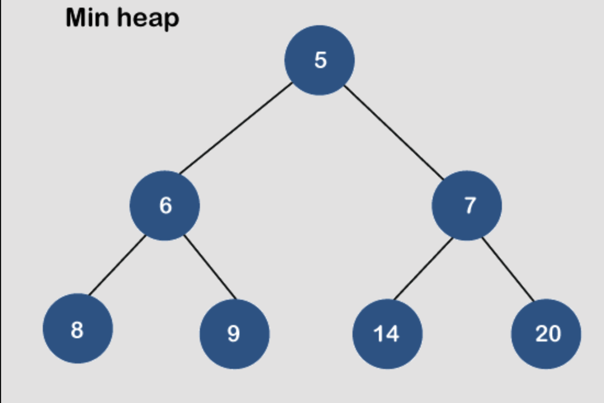

# Куча (heap)

Структура данных, которая представляет собой двоичное дерево, удовлетворяющее свойству кучности.

Куча обеспечивает эффективное выполнение операций вставки, удаления и поиска минимального/максимального элемента.

## Основные свойства кучи:

1. Полное бинарное дерево. 
   Куча является почти полным бинарным деревом, то есть все уровни, кроме последнего, полностью заполнены, а последний уровень заполняется слева направо.

2. Упорядоченность.
   - В максимальной кучи каждый родительский узел больше или равен своим дочерним узлам;

    

  - В минимальной кучи каждый родительский узел меньше или равен своим дочерним узлам.

    

## Типы куч

1. Максимальная куча (max-heap): Каждый родительский элемент больше своих детей;
2. Минимальная куча (min-heap): Каждый родительский элемент меньше своих детей.

## Использование

- Приоритетные очереди. Куча часто используется для реализации приоритетных очередей, где элементы с наивысшим (или наименьшим) приоритетом извлекаются первыми.
- Алгоритм сортировки Heapsort. Куча используется для сортировки массива за время O(n log n).
- Алгоритм Дейкстры. Поиск кратчайшего пути использует кучу для эффективного выбора следующей вершины.

## Преимущества кучи

- Вставка элемента: O(log n);
- Удаление корневого элемента (максимального или минимального): O(log n);
- Поиск максимального или минимального элемента: O(1);

## Недостатки кучи

- Ограниченный доступ к элементам: Поиск произвольного элемента занимает O(n);
- Неэффективность для произвольного удаления; O(n) для поиска элемента + O(log n) для восстановления свойства кучи.
- Неупорядоченность: Куча не хранит элементы в отсортированном порядке;
- Ограниченная применимость: Куча эффективна только для задач, где требуется быстрый доступ к максимальному или минимальному элементу;

## Сложность операций
| Операция                        | Сложность       | Примечание                                                  | 
|:--------------------------------|:----------------|:------------------------------------------------------------|
| Вставка элемента                | O(log n)        | Просеивание вверх (sift-up)                                 |
| Удаление корневого элемента     | O(log n)        | Просеивание вниз (sift-down)                                |
| Удаление произвольного элемента | O(n) + O(log n) | Поиск элемента O(n) + восстановление свойства кучи O(log n) |
| Поиск max/min                   | O(1)            | Корневой элемент                                            |
| Поиск произвольного элемента    | O(n)            | Линейный поиск                                              |
| Построение кучи                 | O(n)            | Линейное время для преобразования массива в кучу            |

## Задачки
1. [Максимальная куча](maxHeap.js)
2. [Минимальная куча](minHeap.js)
3. [Приоритетная очередь](tasks/priorityQueue.js)

## Операции над кучей

1. Вставка (Insert):
   - Новый элемент добавляется в конец кучи (на последний уровень дерева);
   - Затем выполняется операция "просеивания вверх" (sift-up), чтобы восстановить свойство кучи.
2. Удаление корневого элемента (extract):
   - Корневой элемент (максимальный или минимальный) удаляется;
   - Последний элемент кучи перемещается на место корня;
   - Затем выполняется операция "просеивания вниз" (sift-down), чтобы восстановить свойство кучи.
3. Построение кучи (buildHeap):
   - Найти последний нелистовой узел (родительский узел последнего элемента);
   - Затем выполняется операция "просеивания вниз" (sift-down) для этого узла;
   - Повторить шаги 1–2 для всех предыдущих родительских узлов, двигаясь вверх по дереву.

Просеивания вверх (sift-up) - означает, что элемент сравнивается с родительским узлом и, если необходимо, меняется местами, пока свойство кучи не будет выполнено.

Просеивания вниз (sift-down) - означает, что элемент сравнивается с дочерними узлами и, если необходимо, меняется местами с наибольшим (для max-heap) или наименьшим (для min-heap) дочерним элементом, пока свойство кучи не будет выполнено.

## Ресурсы
- [Владимир Балун](https://youtu.be/MOn4N7GCT5c?si=uLihFSbo1-RIs_zQ)