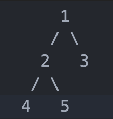

# Деревья

Структура данных, состоящая из узлов (вершин), где каждый узел может иметь несколько подузлов (потомков), но один родительский узел.

## Основные характеристики дерева

- Имеется один корневой узел (root node);
- Узлы могут иметь ноль или более дочерних узлов;
- Нет циклов (циклы приводят к графам, а не деревьям).

## Основные термины

- Корень (Root): Первый узел в дереве;
- Родитель (Parent): Узел, который имеет дочерние узлы;
- Дети (Children): Узлы, которые связаны с родителем;
- Листья (Leaves): Узлы без дочерних элементов;
- Высота: Количество ребер от корня до самого дальнего листа;
- Глубина: Количество ребер от корня до конкретного узла;
- Поддерево: Часть дерева, начинающаяся с любого узла.

## Типы деревьев

- [Бинарное дерево (Binary Tree)](binaryTree/README.md);
- [Бинарное дерево поиска (Binary Search Tree)](binarySearchTree/README.md);
- [Сбалансированное дерево (AVL Tree)](/README.md);
- [Сбалансированное дерево (Red-Black Tree)](/README.md);

## Подтипы

- Полное бинарное дерево. В полном бинарном дереве каждый узел либо является листом (не имеет потомков), либо имеет ровно два потомка;
   

- Совершенное бинарное дерево. Это полное бинарное дерево, где все листья находятся на одном уровне;
   

- Вырожденное бинарное дерево. Это дерево, где каждый узел имеет только одного потомка;
   

- Сбалансированное бинарное дерево. Это дерево, где разница высот между левым и правым поддеревьями любого узла не превышает единицы.
   
