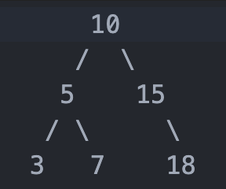

# Бинарное дерево поиска (Binary Search Tree)

Структура данных, состоящая из узлов (вершин), где каждый узел иметь максимум два дочерних узла, но один родительский узел.

Специализированная форма бинарного дерева, которая обеспечивает упорядоченность данных.
Это делает BST эффективной структурой для поиска, вставки и удаления элементов.

## Основные правила

- Дерево должно иметь корень;
- Значения меньше текущего узла добавляются в левое поддерево;
- Значения больше текущего узла добавляются в правое поддерево;
- Каждый узел имеет максимум два дочерних узла: левый (left) и правый (right).

## Использование

- Поиск элементов: Быстрый поиск элементов за время O(log n) в сбалансированном дереве;
- Сортировка: Можно использовать BST для сортировки данных через обход "in-order";
- Хранение данных: Хранение данных в упорядоченной форме для быстрого доступа;
- Реализация [множеств](tasks/bstSet/README.md) и [словарей](tasks/bstMap/README.md): Множества и словари часто реализуются на основе BST.

## Преимущества

- Эффективный поиск: В сбалансированном дереве поиск выполняется за O(log n);
- Динамическое изменение: Легко добавлять или удалять элементы без необходимости полной перестройки структуры;
- Поддержка обходов: Обходы "in-order", "pre-order" и "post-order" позволяют легко получить данные в нужном порядке.

## Недостатки

- Вырождение: Если дерево становится вырожденным (например, при последовательной вставке), сложность операций возрастает до O(n);
- Сложность балансировки: Для поддержания баланса требуются дополнительные алгоритмы (например, AVL или Red-Black);
- Память: Требуется дополнительная память для хранения ссылок на потомков.

## Основные операции

### Вставка (Insert)

1. Вставка начинается с корня;
2. Сравнивается значение нового элемента:
   - Если значение < текущего узла, то переходим к левому потомку;
   - Если значение > текущего узла, то переходим к правому потомку.
3. Повторяем шаг 2, пока не достигнем узла, у которого нет соответствующего потомка;
4. Вставляем новый элемент как потомка:
   - Если значение < текущего узла, то добавляем его как левого потомка;
   - Если значение > текущего узла, то добавляем его как правого потомка.

### Удаление узла (remove)

1. Случай. Узел без потомков (лист);
   - Просто удаляем узел, установив ссылку родителя на null.
2. Случай. Узел с одним потомком;
   - Заменяем удаляемый узел его единственным потомком.
3. Случай. Узел с двумя потомками;
   - Ишим минимальный элемент в правом поддереве;
   - Заменяем его с удаляемым элементом;

### Поиск узла (searchNode)

1. Поиск начинается с корня;
2. Сравнивается искомое значение с текущим узлом:
   - Если значение == текущему узлу, элемент найден;
   - Если значение < текущего узла, то переходим к левому потомку;
   - Если значение > текущего узла, то переходим к правому потомку.
3. Повторяем шаг 2, пока не найдем элемент или не достигнем конца дерева;
4. Если достигли пустого узла, элемент отсутствует в дереве.

### Симметричный обход (In-order Traversal)

Симметричный обход возвращает значения узлов в возрастающем порядке.

 

Посещаем узлы в следующем порядке:

1) Рекурсивно обходим левое поддерево;
2) Посещаем текущий узел;
3) Рекурсивно обходим правое поддерево.

Результат: 3, 5, 7, 10, 15, 18

### Прямой обход (Pre-order Traversal)

Прямой обход используется для создания копии дерева или сериализации, так как он сохраняет структуру дерева.

 

Посещаем узлы в следующем порядке:

1) Посещаем текущий узел;
2) Рекурсивно обходим левое поддерево;
3) Рекурсивно обходим правое поддерево.

Результат: 10, 5, 3, 7, 15, 18

### Обратный обход (Post-order Traversal)

Обратный обход используется для удаления дерева, так как сначала удаляются потомки, затем родитель.

 

Посещаем узлы в следующем порядке:

1) Рекурсивно обходим левое поддерево;
2) Рекурсивно обходим правое поддерево;
3) Посещаем текущий узел;

Результат: 3, 7, 5, 18, 15, 10

### Обход в ширину (Level-order Traversal)

Посещаем узлы уровня за уровнем, начиная с корня. Для этого используется очередь (FIFO).

 

Посещаем узлы в следующем порядке:

1) Создаем очередь и добавляем в нее корень дерева;
2) Извлекаем первый узел из очереди;
3) Посещаем этот узел;
4) Добавляем его левого и правого потомков в очередь.

Результат: 10, 5, 15, 3, 7, 18

## Сложность операций

| Операция | Сложность (худший случай) | Сложность (лучший случай) | 
|:---------|:--------------------------|:--------------------------|
| Вставка  | O(n)                      | O(log n)                  |
| Удаление | O(n)                      | O(log n)                  |
| Поиск    | O(n)                      | O(log n)                  |
| Обход    | O(n)                      | O(n)                      |

## Задачки

1. [Реализовать узел бинарного дерева поиска](node.js)
2. [Реализовать бинарное дерево поиска](binarySearchTree.js)

## Ресурсы

- [Владимир Балун](https://www.youtube.com/watch?v=L_0U84p5GPk)