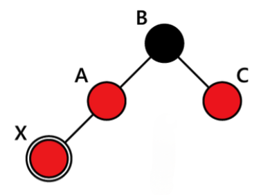
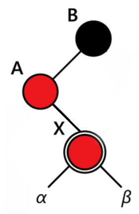
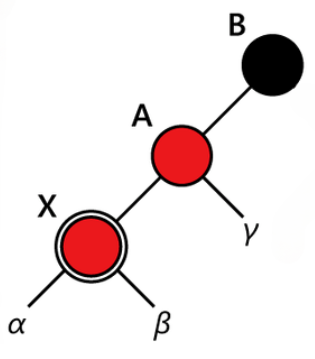

# Красно-черное дерево (Red-Black Tree)

Структура данных, состоящая из узлов (вершин), где каждый узел иметь максимум два дочерних узла, но один родительский узел.

Оно является расширением обычного BST и добавляет дополнительные правила для поддержания баланса дерева.

## Основные правила

Каждый узел в красно-черном дереве имеет цвет: красный или черный. Эти цвета помогают поддерживать баланс дерева.

- Корень всегда черный;
- Каждый узел либо красный, либо черный;
- Все листья (пустые узлы) черные;
- Каждый красный узел должен иметь два черных узла, черный может иметь черных сыновей;
- На каждом пути от данного узла до любого из его листьев должно быть одинаковое количество черных узлов.

## Использование

- Красно-черные деревья используются там, где требуется эффективная работа с упорядоченными данными, особенно в случаях, когда важно сохранять баланс дерева для обеспечения логарифмической производительности;
- Реализация ассоциативных массивов множества и словари (Set/Map).

## Преимущества

- Сбалансированность: Дерево остается сбалансированным благодаря правилам окраски узлов;
- Эффективность: Все основные операции (поиск, вставка, удаление) выполняются за время O(log n);
- Простота восстановления баланса: После вставки или удаления дерево легко восстанавливает баланс через перекраску и повороты.

## Недостатки

- Сложность реализации: Поддержание баланса требует выполнения нескольких шагов (перекраска, повороты).

## Основные операции

### Вставка элемента

1) Новый узел добавляется как красный (чтобы не нарушить правило "черной высоты");
2) Переходим к восстановлению баланса.

### Восстановлению баланса

1) Если родителя или дедушки нового узла нет, никаких действий не требуется;
2) Если родитель нового узла черный, никаких действий не требуется;
3) Если родитель нового узла красный, проверяем дядю;
4) Если дядя красный:
    

   - Перекрашиваем родителя и дядю в черный;
   - Перекрашиваем дедушку в красный;
   - Переходим к дедушке и повторяем процесс, так как он теперь может быть красным.

5) Если дядя черный или не существует. Возможны два случая;
6) Случай треугольник (неправильное положение узлов):
    

   - Новый узел и его родитель находятся в разных направлениях относительно дедушки (например, родитель слева, а новый узел справа);
   - Выполняем малый поворот вокруг родителя, чтобы преобразовать треугольник в прямую линию.

8) Случай прямая линия (правильное положение узлов):
    

   - Новый узел и его родитель находятся в одном направлении относительно дедушки (например, оба слева или оба справа);
   - Перекрашиваем родителя в черный;
   - Перекрашиваем дедушку в красный;
   - Выполняем большой поворот вокруг дедушки.

### Левый поворот

1) Сохраняем правого потомка узла;
2) Связываем правого потомка узла с левым потомком правого потомка узла;
3) Если у правого потомка узла есть левый потомок, то связываем родителя левого потомка с узлом;
4) Связываем родителя правого потомка узла с родителем узла;
5) Если узел корень, то правый потомок узла становится новым корнем;
6) Если узел равен левому потомку родителя узла, то связываем левого потомка родителя узла с правым потомком узла;
7) Иначе связываем правого потомка родителя узла с правым потомком узла;
8) Связываем левого потомка правого потомка узла с узлом;
9) Связываем родителя узла с правым потомком узла.

### Правый поворот

1) Сохраняем левого потомка узла;
2) Связываем левого потомка узла с правым потомком левого потомка узла;
3) Если у левого потомка узла есть правый потомок, то связываем родителя правого потомка с узлом;
4) Связываем родителя левого потомка узла с родителем узла;
5) Если узел корень, то левый потомок узла становится новым корнем;
6) Если узел равен правому потомку родителя узла, то связываем правого потомка родителя узла с левым потомком узла;
7) Иначе связываем левого потомка родителя узла с левым потомком узла;
8) Связываем правого потомка левого потомка узла с узлом;
9) Связываем родителя узла с левым потомком узла.

## Сложность операций

| Операция | Сложность | 
|:---------|:----------|
| Вставка  | O(log n)  |
| Удаление | O(log n)  |
| Поиск    | O(log n)  |
| Обход    | O(n)      |

## Задачки

1. [Реализовать узел красно-черного дерева](node.js)
2. [Реализовать красно-черное дерево](redBlackTree.js)

## Ресурсы

- [Школа IT Terra](https://www.youtube.com/watch?v=kr_cpPikT0M&t=6s)
- [Визуализация](https://www.cs.usfca.edu/~galles/visualization/RedBlack.html)